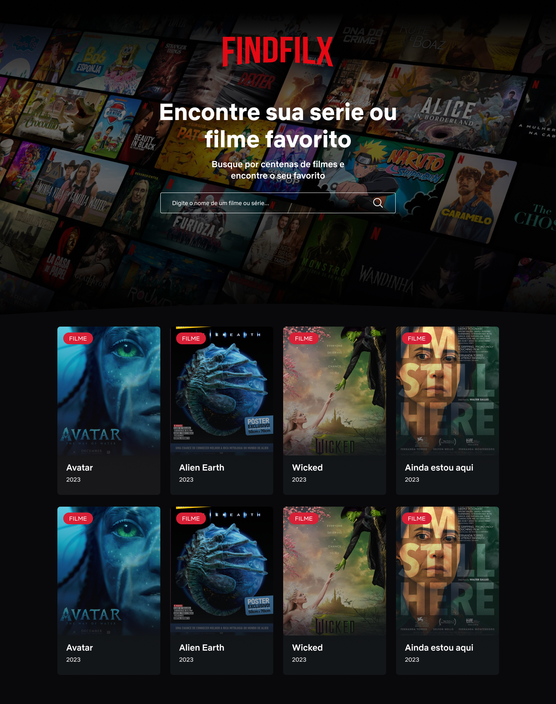

# Findflix

Aplicação de busca instantânea de filmes e séries usando a API do OMDB.

## Sobre o Projeto

Interface responsiva criada para fazer buscas e exibir os resultados em tempo real conforme o usuário digita no campo de busca.
Ao passar o mouse (ou tocar em mobile) aparecerá mais detalhes do título em questão.

## Link de teste

Acessar o [Findflix](https://brunoliimas.github.io/findflix/)

## Template do projeto



## Tecnologias Utilizadas

- **HTML5** - Estrutura simples e semântica
- **Sass/SCSS** - Pré-processador CSS com variáveis, mixins e organização modular para melhor manutenção
- **JavaScript Vanilla** - Sem frameworks, apenas JS puro
- **OMDB API** - Base de dados de filmes e séries

## 📋 Funcionalidades

- ✅ Modal para adquirir a key da API ou usar a key de teste
- ✅ Busca instantânea com debounce (500ms)
- ✅ Cache de requisições para otimizar performance
- ✅ Lazy loading de imagens
- ✅ Design responsivo (mobile-first)
- ✅ Detalhes ao passar o mouse/tocar
- ✅ Loading states e mensagens de erro
- ✅ Compatível com navegadores modernos

## 🏗️ Estrutura do Projeto

```
findflix/
├── index.html              # Página principal
├── assets                  # Pasta de arquivos
├── src/
│   ├── scss/               # Arquivos Sass
│   │   ├── abstracts/      # Variáveis e mixins
│   │   ├── base/           # Reset e estilos base
│   │   ├── components/     # Componentes (movie-card, search, etc)
│   │   ├── layout/         # Grid e containers
│   │   └── main.scss       # Arquivo principal
│   └── js/                 # JavaScript modular
│       ├── api/            # Serviços de API
│       ├── components/     # Componentes UI
│       ├── utils/          # Funções utilitárias
│       └── app.js          # App principal
├── dist/                   # Arquivos compilados
│   └── css/
├── package.json
└── .gitignore
```

## 📦 Instalação

```bash
# Clonar o repositório via SSH
git clone git@github.com:brunoliimas/findflix.git

# Entrar na pasta
cd findflix

# Instalar dependências
npm install

# Compilar Sass e assistir mudanças
npm run sass:watch

# Ou compilar uma vez
npm run sass:build
```

## 🎮 Scripts Disponíveis

- `npm run sass:watch` - Compila Sass e assiste mudanças
- `npm run sass:build` - Compila Sass para produção (comprimido)

## ❓ Como Usar

### Primeira Vez

1. Abra a aplicação
2. Modal de configuração aparece automaticamente
3. Siga os 3 passos para obter sua API key (leva 2 minutos)
4. Cole a key e valide
5. Comece a buscar filmes!

### Buscando Filmes

1. Digite o nome do filme ou série no campo de busca
2. Resultados aparecem automaticamente
3. **Desktop**: Passe o mouse sobre um card para ver detalhes
4. **Mobile**: Toque no card para expandir os detalhes

### Reconfigurando API Key

- Clique no ícone de engrenagem (⚙️) no canto superior direito
- Modal de configuração reabre
- Configure uma nova API key

## 🔑 API

Usando OMDB API com a chave: `342aa484` ou crie sua própria 

- **Search**: `http://www.omdbapi.com/?apikey=342aa484&s={termo}`
- **Details**: `http://www.omdbapi.com/?apikey=342aa484&i={imdbID}`

## 🏃🏻‍♂️ Otimizações de Performance

- Debounce de 500ms para reduzir requisições
- Cache de detalhes dos filmes
- Lazy loading de imagens
- CSS com variáveis para melhor performance
- Minimização de reflows/repaints

## 🔒 Segurança

- Cada usuário usa sua própria API key
- Keys armazenadas apenas no localStorage do navegador
- Validação antes de salvar
-  Nenhuma key hardcoded no código-fonte (somente a key test)
- Sem compartilhamento de limites de requisições

## 📱 Responsividade

- Mobile-first approach
- Breakpoints: 768px (tablet), 1024px (desktop)
- Touch-friendly para dispositivos móveis
- Grid adaptativo

## 🎯 Requisitos Atendidos

- [x] JavaScript Vanilla (sem frameworks)
- [x] Busca instantânea
- [x] Exibir poster, título e tipo
- [x] Detalhes ao hover/touch
- [x] Sem Bootstrap/Foundation
- [x] Pré-processador CSS (Sass)
- [x] Responsivo para mobile
- [x] Performance otimizada
- [x] Controle de requisições à API

## ⭐️ Funcionalidades extras 

- Modal de API Key

## 📄 Licença

MIT

## 👤 Autor

[Bruno Lima](https://brunolima.dev.br/)
